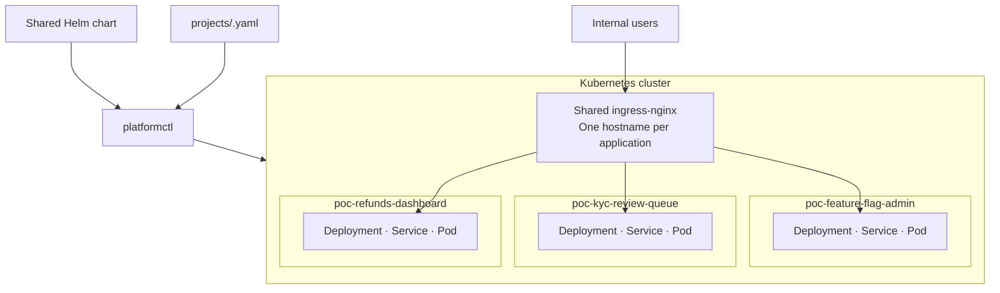

# Internal Application Platform POC

A working proof of concept for evaluating whether three Microsoft Power Apps
could become independently developed, in-house web applications deployed
through a lightweight Kubernetes platform.

This repository tests a narrow proposition: can engineering teams package
internal tools as ordinary containers and operate them through one consistent
deployment path? It is not an attempt to reproduce Power Apps as a general
low-code product.

## What is in this repository

The POC contains three FastAPI applications and the platform that builds and
deploys them:

| Component | Purpose |
| --- | --- |
| [feature-flag-admin](feature-flag-admin/) | Feature CRUD, admin/viewer roles, percentage and team targeting, and audit history |
| [kyc-review-queue](kyc-review-queue/) | KYC case triage, escalation, required decision reasons, analyst/senior roles, and audit history |
| [refunds-dashboard](refunds-dashboard/) | Refund review, approval threshold, required reasons, finance roles, mocked payouts, and audit history |
| [platform](platform/) | Local kind cluster, shared Helm chart, project configuration, `platformctl`, and prototype AKS infrastructure |

Each application owns its code, container image, business rules, roles, and
SQLite database. It does not import or depend on platform code.

## Architecture

The platform is a lightweight **Internal Developer Platform (IDP)** using a
shared Kubernetes cluster and one namespace per application.



The applications share:

- One Kubernetes cluster and its compute capacity
- One ingress controller for hostname-based routing
- One generic Helm chart that creates a Deployment, Service, and Ingress
- One CLI for building, deploying, inspecting, and deleting applications
- One runtime contract: `$PORT`, `$DATA_DIR`, and `GET /healthz`
- Common CPU and memory defaults

They do not share application processes, databases, role definitions, business
rules, or release lifecycles. Namespaces provide organization and lifecycle
isolation, but are not complete security boundaries by themselves.

## How deployment works

Each application has one file under [platform/projects](platform/projects/):

```yaml
id: feature-flag-admin
repo: ../feature-flag-admin
image: poc/feature-flag-admin:0.1.0
host: flags
```

The flow is:

```text
Application folder --Docker--> container image
Project YAML -------platformctl + Helm-------> Kubernetes resources
Container image ------------------------------------> running Pod
```

`repo` identifies the Docker build context. `image` identifies what Kubernetes
runs. `host` publishes the application through ingress. After the image is
built, Kubernetes has no connection to the source folder.

## Run locally

### Prerequisites

- Python 3
- Docker
- kind
- kubectl
- Helm

Docker must be running. `platformctl` creates its Python virtual environment on
first use.

### Start the platform

```bash
cd platform
./platformctl bootstrap --target local
./platformctl build --load
./platformctl deploy --wait
```

Open:

- <http://flags.poc.localhost:8080>
- <http://kyc.poc.localhost:8080>
- <http://refunds.poc.localhost:8080>

`*.localhost` resolves to `127.0.0.1` automatically, so no hosts-file change is
required.

Useful operator commands:

```bash
./platformctl list
./platformctl status
./platformctl render feature-flag-admin
kubectl logs -n poc-feature-flag-admin deployment/feature-flag-admin
```

## Add an application

An application can use any language or framework. Its container must:

1. Listen on `$PORT` and bind to `0.0.0.0`.
2. Return a successful response from `GET /healthz`.
3. Write runtime files only below `$DATA_DIR`.
4. Provide a Dockerfile.

Create and edit its project configuration:

```bash
cd platform
./platformctl new my-project
$EDITOR projects/my-project.yaml
```

Then validate, build, and deploy it:

```bash
./platformctl render my-project
./platformctl build my-project --load
./platformctl deploy my-project --wait
```

Onboarding does not require a platform code change or a new Helm chart. See the
[operations guide](platform/docs/operations-guide.md) for the complete workflow.

## What this POC proves

- Three unrelated applications can run side by side in one shared cluster.
- Applications can be deployed, upgraded, inspected, and removed independently.
- A small configuration file can onboard another containerized application.
- The same Helm chart and project model can be rendered for local kind and AKS.
- Applications remain portable because they depend only on a container contract.

The AKS Bicep and deployment path are written but have not been exercised
against a real Azure subscription.

## What this POC does not prove

This repository is not production software. It has:

- No enterprise authentication; users are simulated with an unverified header
- No central authorization, segregation of duties, or tamper-evident audit log
- No durable storage; replacing a Pod loses its local SQLite data
- No TLS, secrets management, network policy, or strong tenant isolation
- No real payment, KYC, identity, ledger, or SIEM integrations
- No production CI/CD, observability, backup, disaster recovery, or on-call model
- No low-code editor for non-engineers

All data is synthetic and every external integration ends at a mocked boundary.
These missing capabilities represent much of the operational value supplied by
Power Apps and must be included in any build-versus-buy decision.

## Documentation

| Document | Start here when you want to understand... |
| --- | --- |
| [In-house solution prototype](platform/docs/in-house-solution-prototype.md) | What was built, what it proves, and the proposed production direction |
| [Business overview](platform/docs/business-view.md) | The value, risks, and decision in non-Kubernetes language |
| [Current architecture](platform/docs/architecture.md) | What runs today and how requests and deployments flow |
| [Target architecture](platform/docs/target-architecture.md) | The proposed end state and its assumptions |
| [Gap analysis](platform/docs/gap-analysis.md) | What separates the POC from the target |
| [Migration plan](platform/docs/migration-plan.md) | The phased path, gates, and stopping points |
| [Operations guide](platform/docs/operations-guide.md) | Setup, daily commands, onboarding, and troubleshooting |
| [Running multiple applications](platform/docs/running-multiple-applications.md) | How Kubernetes schedules and routes the applications |

## Tests

Run the platform configuration and Helm-rendering tests:

```bash
cd platform
./platformctl list
./.venv/bin/python -m pytest tests
```

Each application also has an independent test suite in its own `tests/`
directory.
