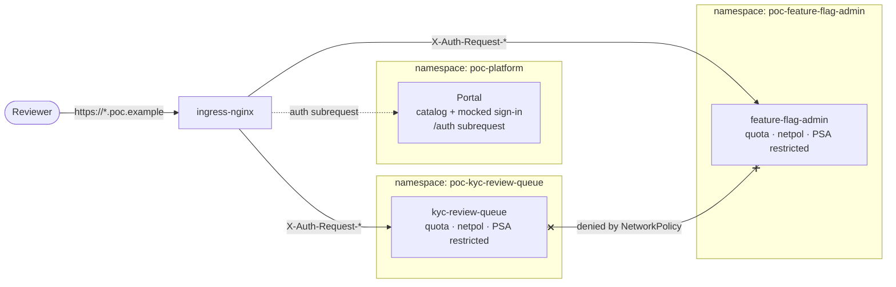

# Architecture

The platform is a cluster with an opinion about namespaces, and a CLI that turns
one YAML file into the manifests that express it. There is no platform runtime:
nothing supervises the projects, nothing proxies their traffic in application
code, and no project imports anything from here.

## The pieces

**One generic chart.** `charts/poc-app` is deployed once per project. Nothing in
it is project-specific; every difference is a value derived from
`projects/<id>.yaml` by `platform_cli/render.py`. Adding project number four
changes no chart, no CLI code and no platform manifest.

**One file per project.** `projects/<id>.yaml` is the whole configuration:
image, port, hostname, roles, group mapping, size, data classification,
capabilities and limitations. It is validated against `policy.yaml` before
anything reaches the cluster.

**A namespace per project.** `poc-<id>`, created by the project's own Helm
release, so `platformctl delete <id>` takes the namespace and everything in it.
Because a release cannot live in the namespace it creates, all release state is
kept in `poc-platform`.

**Identity at the edge, roles in the app.** The ingress annotation
`auth-url` makes nginx call the portal's `/auth` for every request. The portal
answers `202` with `X-Auth-Request-Email`, `-User` and `-Groups`, nginx copies
those onto the upstream request (overwriting anything the browser sent), and the
project maps groups to its own roles. Unauthenticated requests are redirected to
the portal's sign-in page.

## Local and AKS are the same deployment

| | Local (kind) | AKS |
| --- | --- | --- |
| Cluster | `local/kind-cluster.yaml`, ports 8080/8443 published | `infra/aks/main.bicep`: 2 nodes, Azure CNI overlay, **Calico** network policy, ACR, Log Analytics |
| Ingress | `bootstrap/ingress-nginx.local.yaml`, host ports | `bootstrap/ingress-nginx.aks.yaml`, internal Azure load balancer |
| Images | built and `kind load`ed | built and pushed to ACR; the kubelet identity has `AcrPull` |
| Identity | the portal's persona picker | oauth2-proxy + Entra ID at the same `auth-url`; the projects do not change |
| TLS | none, plain HTTP on 8080 | cert-manager, `platform.tls` in `platform.yaml` |

Everything else — chart, project files, namespaces, quotas, policies, hostnames
— is byte-identical. `platform.yaml` holds the handful of values that differ.

## Isolation, and how far it goes

Each project namespace gets, from the same chart:

- Pod Security Admission `enforce: restricted`;
- a `ResourceQuota` (sized from `size` × `replicas`, plus room for one surge
  pod) and a `LimitRange`, so one project cannot starve another;
- a service account with `automountServiceAccountToken: false`;
- a default-deny `NetworkPolicy` for ingress *and* egress, plus one allow rule:
  ingress from the `ingress-nginx` namespace, egress to kube-dns;
- a container that runs as uid 10001, non-root, with a read-only root
  filesystem, no privilege escalation and all capabilities dropped.

Verified on the local cluster:

| Attempt | Result |
| --- | --- |
| `kyc` pod → `feature-flag-admin.poc-feature-flag-admin.svc:8000` | times out (default-deny egress) |
| `kyc` pod → `1.1.1.1:443` | times out (no internet egress) |
| `kyc` pod → Kubernetes API | reachable at TCP level, `403 Forbidden`: no token is mounted |
| `touch /app/x` in the container | read-only file system |
| browser-supplied `X-Auth-Request-Email: attacker@example.com` | overwritten by nginx; the app sees the signed-in persona |
| any project URL without a session | `302` to the portal's sign-in |

The API-server row is the honest limit of NetworkPolicy: traffic to the node
itself is not reliably blockable by it, which is why the token is removed
instead. On AKS the same policies are enforced by Calico (see the network
profile in `main.bicep`) — without a policy-capable CNI they would be silently
ignored, which is the one thing about the cluster that is not optional.

## What is deliberately missing

No service mesh, no per-project CI, no secret store, no shared UI toolkit, no
platform database, no cross-project traffic. The portal is a mock: it asserts an
identity nobody verified, which is exactly why it is a separate deployment
behind the same `auth-url` that a real OIDC proxy would occupy. See
[poc-environment.md](poc-environment.md) for the full boundary and
[roadmap.md](roadmap.md) for what closing each gap costs.
