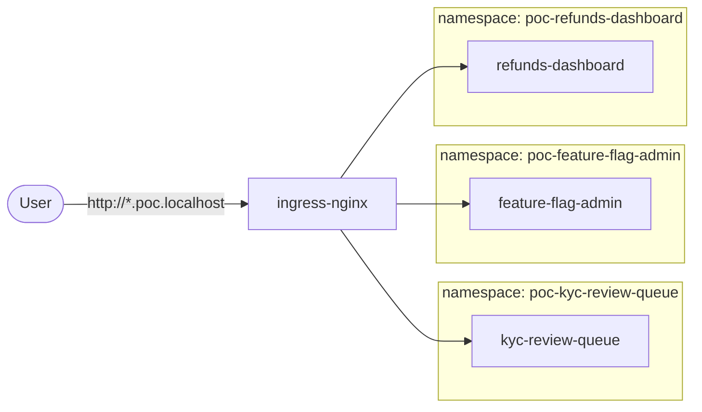

# Architecture

The platform is a cluster with an opinion about namespaces, and a CLI that turns
one YAML file into the manifests that express it. There is no platform runtime:
nothing supervises the projects, nothing proxies their traffic, and no project
imports anything from here.

## The pieces

**One generic chart.** `charts/poc-app` renders a Deployment, a Service and an
Ingress, and is deployed once per project. Nothing in it is project-specific;
every difference is a value derived from `projects/<id>.yaml` by
`platform_cli/render.py`. Adding project number four changes no chart, no CLI
code and no platform manifest.

**One file per project.** `projects/<id>.yaml` is the whole configuration:
image, hostname, and optionally port, health path, replicas and environment
variables. Everything else has a default.

**A namespace per project.** `poc-<id>`, created by `helm upgrade --install
--create-namespace`, so `platformctl delete <id>` takes the namespace and
everything in it. Projects never share one.

**A hostname per project.** `<host>.<domain>`, routed by a single Ingress
object. Nothing sits between the browser and the pod.

## What a project has to do

Listen on `$PORT`, answer `GET /healthz` while it is alive, and write only under
`$DATA_DIR`. Those two variables are the entire runtime contract — the chart
sets them, and a project that reads them runs identically under `docker run`, on
kind and on AKS.

## Local and AKS are the same deployment

| | Local (kind) | AKS |
| --- | --- | --- |
| Cluster | `local/kind-cluster.yaml`, ports 8080/8443 published | `infra/aks/main.bicep`: 2 nodes, Azure CNI overlay, ACR |
| Ingress | `bootstrap/ingress-nginx.local.yaml`, host ports | `bootstrap/ingress-nginx.aks.yaml`, internal Azure load balancer |
| Images | built and `kind load`ed | built and pushed to ACR; the kubelet identity has `AcrPull` |

Everything else — the chart, the project files, the namespaces and the
hostnames — is identical. `platform.yaml` holds the handful of values that
differ. The Bicep has not been run against a real subscription.

## What this prototype is not

It demonstrates the deployment model and nothing else. Left out, deliberately:

| Missing | What the production version is |
| --- | --- |
| Authentication | oauth2-proxy or Entra ID at the ingress, asserting the caller to each app |
| Isolation between projects | default-deny NetworkPolicies, Pod Security Admission, no service-account token |
| Fair sharing | a ResourceQuota and LimitRange per namespace |
| Durable state | a PersistentVolumeClaim instead of the pod's own filesystem |
| Secrets | a secret store (Key Vault via CSI), not environment variables in a YAML file |
| TLS | cert-manager and a real domain |
| Governance | a policy check in CI over the project files, and admission control in the cluster |

Each app still has roles (an analyst cannot see an escalated KYC case; only
finance can approve a large refund), because that behaviour is the point of the
apps. The acting user is whoever the browser says it is via an `X-User` header:
enough to demonstrate the rules, and not authentication.
