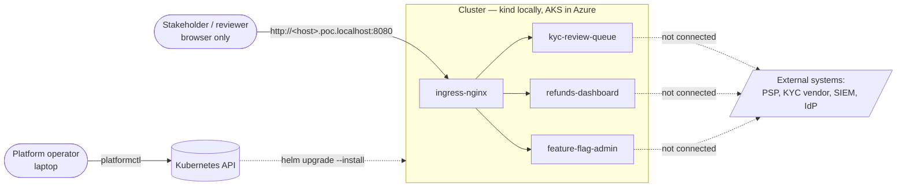
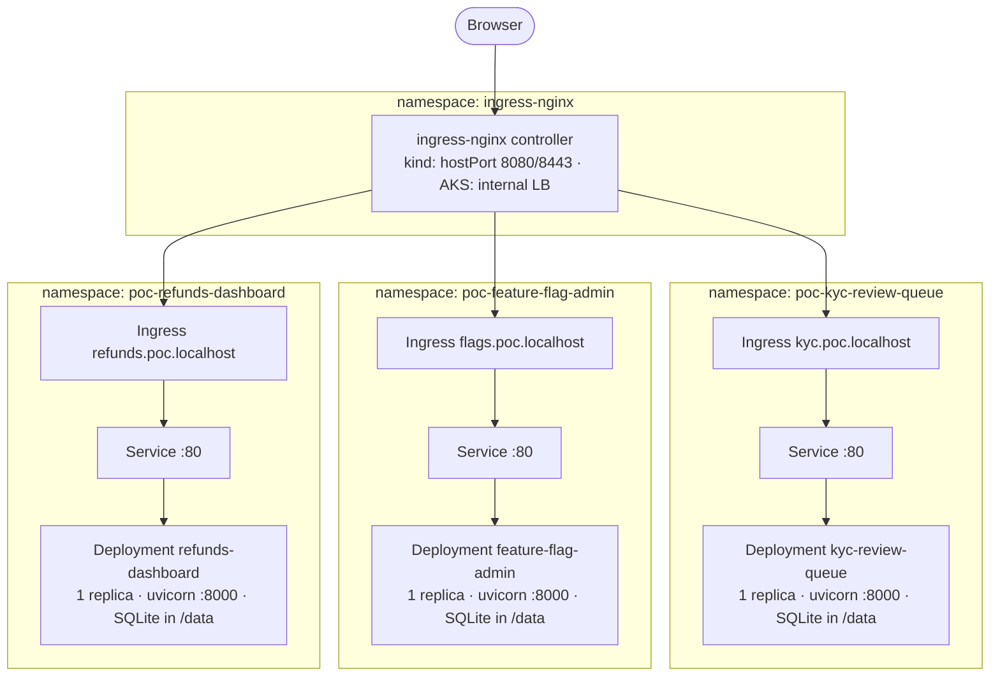
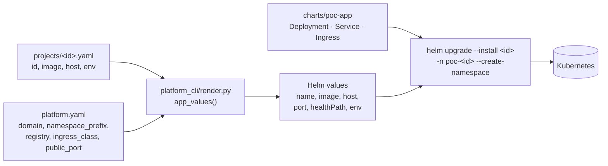
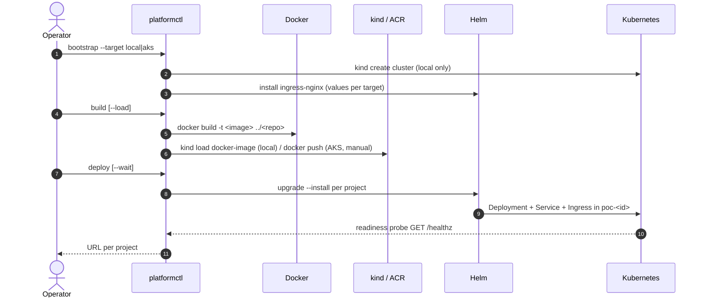
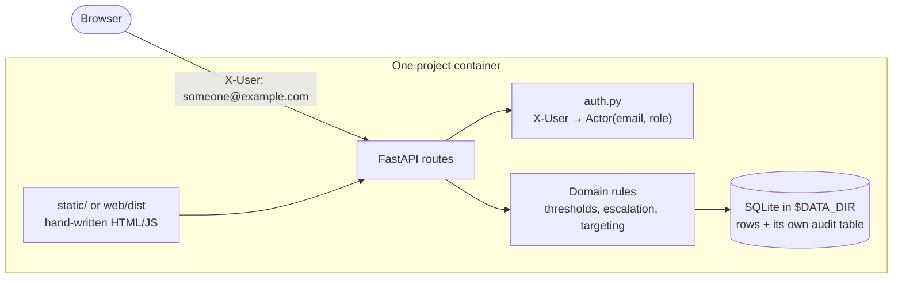
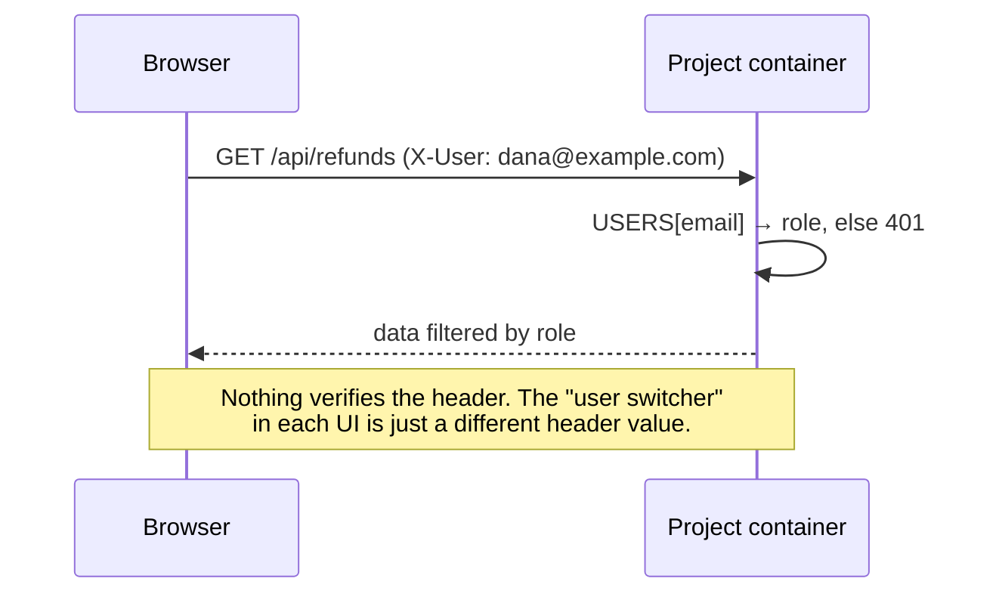

# Current architecture (the POC)

*What actually runs today, verified against the code in this repository.*
For where this is going, see [target-architecture.md](target-architecture.md);
for the difference between the two, [gap-analysis.md](gap-analysis.md).

The platform is a Kubernetes cluster with an opinion about namespaces, plus a
CLI that turns one YAML file per project into the manifests that express it.
There is no platform runtime: nothing supervises the projects, nothing proxies
their traffic at the application layer, and no project imports anything from
`platform/`.

## 1. Context

Every external boundary is mocked or seeded. There is no identity provider, no
payment processor, no screening vendor and no log sink.

## 2. Deployment view

One namespace, one Deployment, one Service and one Ingress per project — all
rendered from the same chart. Nothing is shared between namespaces except the
ingress controller and the nodes.

## 3. How a project file becomes a running pod

`app_values()` is the entire translation layer between "what a team writes" and
"what Kubernetes runs" — about 20 lines. Because every project goes through it
and through the same chart, adding a project cannot change the *shape* of what
gets deployed.

## 4. Build and deploy, end to end

There is no CI, no image registry promotion and no GitOps: the path from a
commit to a running image is a person typing two commands.

## 5. The runtime contract

Everything the chart tells a container:

| Variable | Value | Meaning |
| --- | --- | --- |
| `PORT` | `8000` unless the project file overrides it | Listen here |
| `DATA_DIR` | `/data` | The only path to write to |
| `env:` from the project file | e.g. `APPROVAL_THRESHOLD_AMOUNT=200` | Whatever the app needs |

Plus one HTTP obligation: answer `GET $health_path` (`/healthz` by default)
while alive — that is the readiness probe, polled every 5s.

That is all. A project that honours it runs identically under `docker run`, on
kind and on AKS, and can leave the platform without changing a line.

## 6. Local and AKS are the same deployment

| | Local (kind) | AKS |
| --- | --- | --- |
| Cluster | `local/kind-cluster.yaml`: 1 node, host ports 8080/8443 | `infra/aks/main.bicep`: 2 × `Standard_D2s_v5`, Azure CNI overlay, RBAC on, system-assigned identity |
| Registry | none — `kind load docker-image` | ACR (Basic), `AcrPull` granted to the kubelet identity |
| Ingress | `bootstrap/ingress-nginx.local.yaml`: 1 replica, hostPort | `bootstrap/ingress-nginx.aks.yaml`: 2 replicas, **internal** Azure load balancer |
| Domain | `poc.localhost` (browsers resolve `*.localhost` themselves) | whatever `platform.yaml` says; no DNS zone is created |
| Public port | 8080 | 80 |

The chart, the project files, the namespaces and the hostnames are identical;
`platform.yaml` holds the handful of values that differ. **The Bicep has never
been run against a real subscription** — the AKS path is written, not proven.

## 7. What is inside a project (they are all the same shape)

| | Feature Flag Admin | KYC Review Queue | Refunds Dashboard |
| --- | --- | --- | --- |
| App code (Python) | 719 LOC | 416 LOC | 609 LOC |
| Frontend | **none in this repo** — `/` returns 503 until `web/` is built | 333 LOC vanilla JS/HTML | 417 LOC vanilla JS/HTML |
| Tests | 165 LOC | 102 LOC | 192 LOC |
| Roles | `admin`, `viewer` | `analyst`, `senior_reviewer` | `support_agent`, `finance_approver` |
| Domain rule that matters | %/team rollout, sticky by `sha256(flag:user_id) % 100` | escalated cases are senior-only | ≥ `APPROVAL_THRESHOLD_AMOUNT` needs finance |
| Audit | own table, own schema | own table, own schema | own table, own schema |
| Mocked boundary | flag reads are local | no screening or document store | payout is simulated |

Three apps, three rosters, three role vocabularies, three audit schemas, three
queue tables. Nothing above the runtime layer is shared — which is exactly the
thing the target architecture proposes to fix.

## 8. Identity today

Roles are real and enforced server-side; *who you are* is not. Any caller can
claim any identity on the roster, and the roster is a dictionary in the app's
own source.

## 9. Testing

| Suite | What it checks | Needs |
| --- | --- | --- |
| `platform/tests` (106 LOC) | project files → Helm values → rendered manifests, hostnames and namespaces unique | `helm` on `$PATH`, no cluster |
| each app's `tests/` | API behaviour, role enforcement, domain rules | pytest only |

Nothing tests the AKS path, the Bicep, or an actual cluster.

## 10. What this prototype deliberately is not

| Missing | What the production version would be |
| --- | --- |
| Authentication | OIDC at the ingress (Entra/Okta via oauth2-proxy), the caller asserted to each app |
| Isolation between projects | default-deny NetworkPolicy, Pod Security Admission, no service-account token, `readOnlyRootFilesystem` (the images run as UID 10001, but the chart sets no `securityContext`) |
| Fair sharing | ResourceQuota and LimitRange per namespace — today only per-container requests/limits (50m/128Mi → 500m/512Mi) |
| Durable state | a PersistentVolumeClaim; today `/data` is the pod's own writable layer, so **every restart is a fresh seeded database** |
| Secrets | Key Vault via the CSI driver; today `env:` in a YAML file in git |
| TLS | cert-manager and a real domain; today plain HTTP |
| Delivery | CI, image scanning, signed images, GitOps; today `docker build` on a laptop |
| Governance | admission control and a policy check over `projects/*.yaml`; today a project file is trusted as written |
| Observability | metrics, logs and traces off-cluster; today `kubectl logs` |

Each app still has roles, because that behaviour is the point of the apps. The
acting user is whoever the browser says it is.
