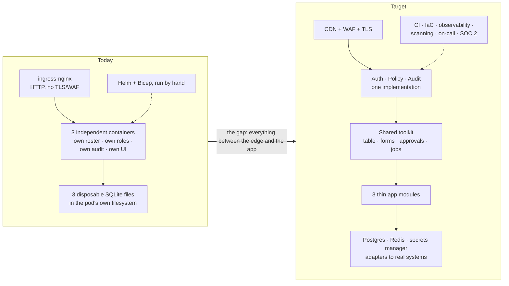

# Current vs target: the differences

*What separates [what runs today](architecture.md) from
[the target](target-architecture.md), how big each gap is, and which ones are
actually decisions rather than work.* The plan for closing them is
[migration-plan.md](migration-plan.md).

**Short answer: the POC covers one box of the target picture — hosting. It
shows that an independent project can be deployed onto a shared cluster by
writing one YAML file, and it deliberately implements none of the rest.**

The two are also opposite shapes. The target's platform is thick (auth, policy,
audit, toolkit) and its apps are thin (300–600 LOC). Today the platform is thin
— a generic Helm chart and a ~390-line CLI, with no runtime of its own — and the
apps carry everything (416–719 LOC of Python each, plus their own frontends,
rosters, role models and audit schemas).

## 1. The two pictures side by side

## 2. Box by box

Effort is engineering-weeks for one engineer working with Devin, to a
production standard rather than a demo one.

| # | Target box | Today | Gap | Severity | Effort |
| --- | --- | --- | --- | --- | --- |
| 1 | **Edge** — CDN + WAF + TLS | ingress-nginx, one hostname per project, internal LB on AKS | No TLS, no WAF, no CDN, no public DNS | High | 0.5–1 |
| 2 | **Auth** — OIDC to Okta/Entra, short-lived sessions | Each app trusts an `X-User` header it does not verify | Total. There is no authentication anywhere | **Critical** | 1–2 |
| 3 | **Policy engine** — one definition, enforced server-side | Three role models (`admin/viewer`, `analyst/senior_reviewer`, `support_agent/finance_approver`), each hard-coded in its own app | No shared vocabulary, no central definition, no way to review who can do what | High | 2–3 |
| 4 | **Audit log** — append-only, shipped to SIEM | Three audit tables, three schemas, all inside disposable SQLite | Not durable, not tamper-evident, not aggregated, not exported | High | 1–2 |
| 5 | **Shared toolkit** — DataTable, schema forms, approvals, jobs | Absent. Queue table, filter bar, decision form and audit timeline are written per app | The entire reuse thesis is unbuilt and unmeasured | **Critical to the business case** | 3–5 |
| 6 | **Apps** — thin, 300–600 LOC | 416–719 LOC of Python each, plus 0–417 LOC of hand-written JS | Roughly 2–3× the target size, all of the excess being duplicated plumbing | Medium | rebuild, see plan |
| 7 | **Platform data** — Postgres, Redis/queue, secrets manager | One SQLite per project in `/data`, which is the pod's own writable layer | No durability (every restart reseeds), no queue, no secrets manager; `env:` sits in git | High | 1–2 |
| 8 | **Integration adapters** | Absent — payouts, screening and flag reads all stop at seeded data | No client, no retries, no idempotency, no dead-letter path, and no evidence about failure behaviour | High | 1–2 per system |
| 9 | **Platform ops** — CI, IaC, observability, scanning, on-call | IaC only (Bicep + Helm), and the Bicep has never been run against a subscription | No CI at all, no metrics/logs/traces off-cluster, no scanning, no pager | High | 2–3 |
| 10 | **Governance** — DLP, environment policy, admission control | A project file is trusted exactly as written | Nothing prevents a project asking for anything | Medium | 1–2 |
| 11 | **Isolation between projects** | Namespace boundary only | No NetworkPolicy, no Pod Security Admission, no quotas; the chart sets no `securityContext` (the images do run as UID 10001) | Medium | 0.5–1 |

## 3. Where the difference actually bites

Three of those rows are not incremental gaps; they change what the thing is.

**Identity (#2).** Every role rule in all three apps is enforced against an
identity the caller chose for itself. The rules are real code and they work —
but the demo of a finance-only payout proves nothing while any browser can
claim to be `dana@example.com`. This is the single blocker to hosting anything
that matters, and everything else in the target assumes it is solved.

**The reuse thesis (#5, #6).** The business case says application #4 costs days
instead of weeks. Nothing in the POC evidences that, because nothing above the
runtime layer is shared. The three apps in fact demonstrate the *opposite*:
each has its own table, its own filter bar, its own decision form and its own
audit timeline. Until a toolkit exists and one app is rebuilt on it, the saving
is an assumption.

**Durability (#7).** `/data` is not a volume. Every pod restart discards all
state and reseeds. That is fine for a demo and disqualifying for anything else,
and it silently invalidates any test of an audit trail.

## 4. Differences that are decisions, not gaps

These are not work items — they are choices where the POC and the target
disagree, and someone has to pick. They gate the plan.

| | Target assumes | POC does | Why it matters |
| --- | --- | --- | --- |
| **Stack** | One Next.js/TypeScript monorepo | Three independent Python/FastAPI containers, each runnable alone | A shared *UI* toolkit needs one frontend stack. Converging is a precondition for box #5, not a detail — and it costs the "any team, any stack, no lock-in" property the POC was built to demonstrate |
| **Cloud** | Managed edge / AWS-style containers, Terraform | AKS + Bicep + ACR | Both are defensible; running both is not. Nothing else can be sized until this is settled |
| **Database** | One Postgres for the platform | SQLite per app | Shared audit and shared approvals need shared storage |
| **Deployment unit** | App modules in one deployable | A container per project | Determines whether `platformctl` survives at all |

A sober reading: **if the answer to "does the app count grow?" is no, the
target is not worth building.** Three applications do not amortise a toolkit,
an on-call rota and SOC 2 evidence. The POC's own model — independent
containers, one YAML file each — is the cheaper answer at that scale, once it
has authentication and durable storage.

## 5. What the POC does and does not evidence

**It evidences the hosting model.** Independent repositories, one generic
chart, a namespace and a URL per project, the same deployment locally and (on
paper) on AKS, and no platform code inside any app. Onboarding really is one
file: `./platformctl new <id>`, edit, deploy.

**It evidences the workflows.** Queue design, role boundaries, mandatory
reasons, approval thresholds, escalation routing and audit content have all
been demonstrated to stakeholders against realistic seeded data. That feedback
is real and survives whatever stack is chosen.

**It does not evidence** the cost thesis, security, isolation, compliance,
durability, integration behaviour, or that the AKS path works at all — the
Bicep has never been applied. The controls that would carry those claims are
exactly the ones the prototype leaves out.

## 6. Deliberate divergences worth keeping

Not everything the POC does differently is a deficiency:

- **A project owes the platform a container and a health check, nothing more.**
  Whatever is built next should keep some version of this contract, or the
  platform becomes a place teams must be conscripted into rather than one they
  choose.
- **The same deployment locally and in the cloud.** A prototype that only runs
  in a shared environment is a prototype nobody iterates on.
- **`platformctl` over a pipeline.** The missing piece is only the path from
  commit to image; the deployment itself is real Kubernetes and does not need
  replacing to get CI.
