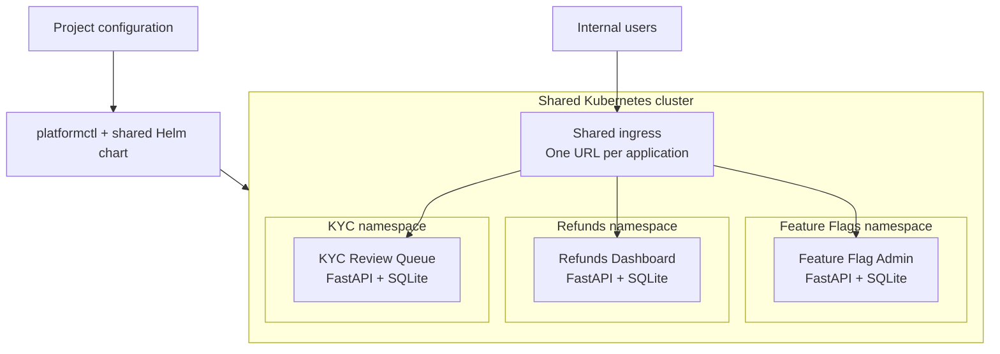
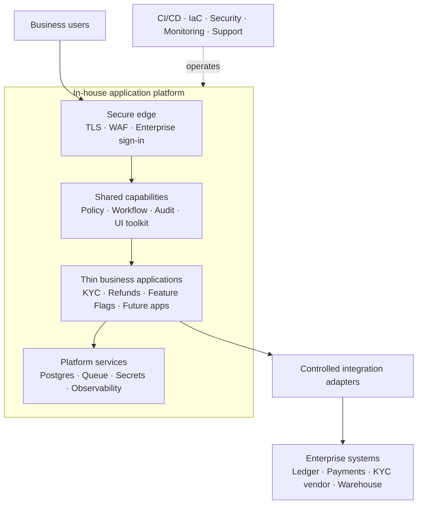

# In-house solution prototype

## Proposed solution

The prototype is a lightweight **Internal Developer Platform (IDP)** built on
Kubernetes. Its purpose is to test whether the three existing Power Apps can be
replaced by independently developed web applications while retaining a
consistent deployment and operating model.

The prototype is not a replacement for Power Apps as a general low-code
platform. It demonstrates a narrower proposition: engineering teams can build
and operate these known applications as ordinary containerized services, using
shared infrastructure and a standard deployment contract.



## What is shared

The prototype shares the infrastructure and deployment path:

- One Kubernetes cluster and its compute capacity
- One ingress controller that routes each hostname to the correct application
- One generic Helm chart that creates a Deployment, Service, and Ingress
- One `platformctl` workflow for build, deploy, status, render, and removal
- One application contract: listen on `$PORT`, expose `GET /healthz`, and write
  only under `$DATA_DIR`
- Common resource defaults for CPU and memory

Each application remains independent. It has its own source code, container
image, namespace, Kubernetes resources, role definitions, business rules,
audit schema, and SQLite database. Applications do not share a process or a
database. They share the cluster nodes on which their isolated containers run.

## How an application is onboarded

A team packages its application as a Docker image and adds one project file:

```yaml
id: feature-flag-admin
repo: ../feature-flag-admin
image: poc/feature-flag-admin:0.1.0
host: flags
```

The `repo` field tells the CLI where to build the image. The `image` field tells
Kubernetes what to run, and `host` gives the application its URL. The platform
combines this configuration with global settings and passes the result through
the shared Helm chart.

```text
Application source -> Docker image -> Helm release -> Kubernetes Pod
Project configuration ------------------------------^
```

Adding an application does not require a new Helm chart or a platform code
change. This is the main capability proven by the prototype.

## What the prototype demonstrates

The working repository demonstrates that:

- Three unrelated internal applications can run side by side in one cluster.
- Each application can be built, deployed, upgraded, inspected, and removed
  independently.
- A small configuration file is sufficient to onboard another containerized
  application.
- The same project definitions and Helm chart can target local kind and AKS.
- Kubernetes can replace failed Pods, route traffic by hostname, and scale an
  application by increasing its replica count.
- Teams remain free to run their applications outside the platform because
  they depend only on a small container contract.

The three applications also demonstrate representative business behavior:

| Application | Demonstrated behavior |
| --- | --- |
| Feature Flag Admin | Flag CRUD, admin/viewer roles, targeting, and audit history |
| Refunds Dashboard | Queue review, approval threshold, reason capture, and mocked payout |
| KYC Review Queue | Case triage, escalation, senior review, and decision history |

## What the prototype does not demonstrate

The POC is intentionally not production-ready. It does not yet provide:

- Enterprise authentication or verified user identity
- Central authorization policy or segregation-of-duties enforcement
- Durable storage; replacing a Pod also replaces its local SQLite data
- TLS, secrets management, network policies, or strong workload isolation
- Central audit retention, tamper evidence, or SIEM integration
- Real Power Platform connectors or production external integrations
- CI/CD, vulnerability scanning, backup and restore, observability, or on-call
  support
- A low-code editor that allows non-engineers to change applications

These are not minor deployment details. They represent much of the value
currently supplied by Power Apps and must be included in any build-versus-buy
cost and risk assessment.

## Proposed production end state

If the prototype advances, the end state should retain independent application
modules while adding shared security, workflow, evidence, and operational
capabilities:



The platform would own workflow, authorization, and operational evidence, but
it would not become a system of record. Customer, payment, KYC, and ledger data
would remain in their existing authoritative systems and be accessed through
controlled adapters.

## Key architectural decisions

1. **Independent containers instead of a low-code runtime.** This preserves
   standard engineering practices and avoids creating a new proprietary
   application format.
2. **One namespace per application.** This provides lifecycle and naming
   isolation, with network and security policies required before production.
3. **One shared Helm chart.** All applications receive the same deployment
   shape and platform controls without maintaining application-specific charts.
4. **A small runtime contract.** Applications are portable and do not import
   platform code.
5. **Shared capabilities only after reuse is proven.** Authentication, policy,
   audit, and delivery controls are necessary. A larger UI and workflow toolkit
   should be funded only if a fourth application proves measurable reuse.
6. **No big-bang migration.** Each module should run beside its Power Apps
   version, pass its own gate, and move behind the routing layer independently.

## Assessment

The prototype validates the basic technical feasibility of hosting the three
applications in-house. It does not yet validate the economics or operational
safety of replacing Power Apps.

The decisive experiment is not whether Devin can generate three applications;
the repository shows that it can accelerate that work. The decisive experiment
is whether the organization can build the shared production controls once,
reuse them across future applications, and own their long-term security and
operation at a lower total cost than the current platform.

The recommended next step is a gated implementation: first confirm the real
Power Apps cost and application pipeline, then add authentication, durable
storage, isolation, and CI/CD. After that, rebuild one module and a fourth
candidate application using the shared capabilities. Continue only if measured
delivery time and maintenance effort support the reuse thesis.
