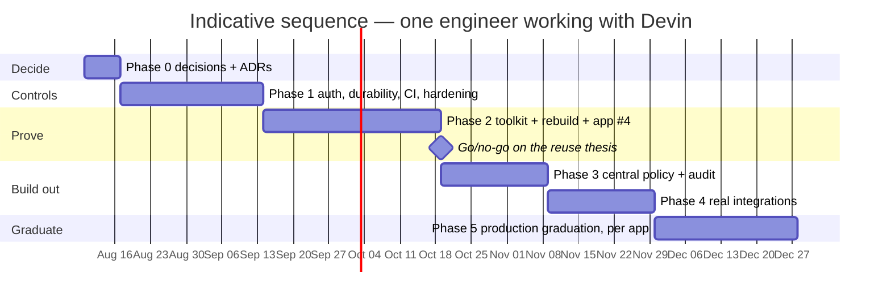
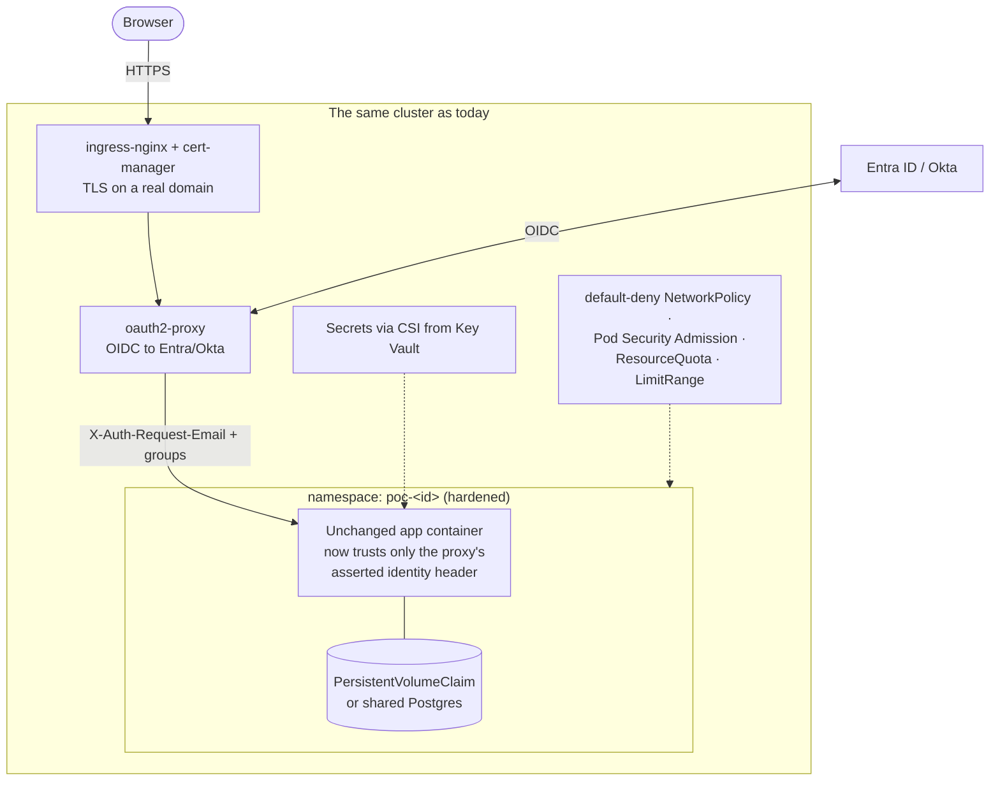
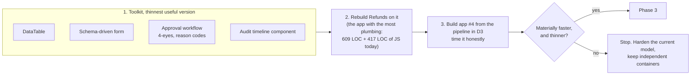
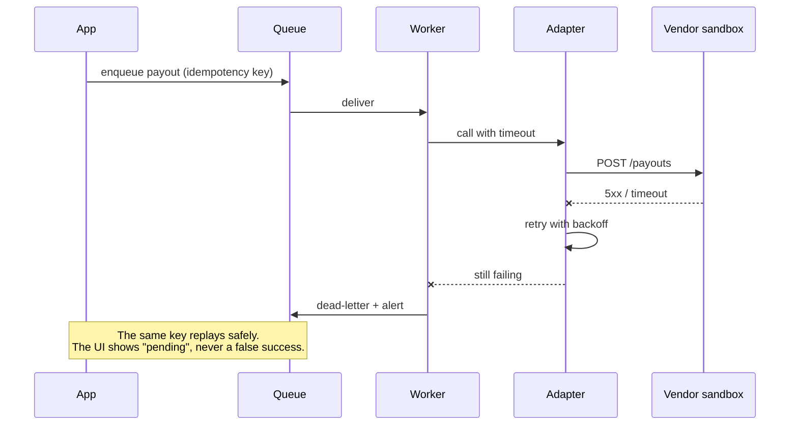

# Migration plan: POC → target

*How to get from [what runs today](architecture.md) to
[the target](target-architecture.md), closing the differences in
[gap-analysis.md](gap-analysis.md) in an order that keeps every step useful on
its own.*

Two principles shape the order below.

**Controls before capability.** Authentication, durable storage and CI are
worth having whichever stack wins, and nothing else can be safely demonstrated
without them. They come first, and they are done to the apps that already
exist.

**Prove the thesis before funding it.** The target's justification is that
application #4 costs days, not weeks. That claim is measurable in about a month.
Measure it before committing to a toolkit, a monorepo, a rewrite, an on-call
rota and SOC 2 evidence.

## Sequence

Roughly 16–20 weeks to a first production-graduated application, with a
genuine stop point at the milestone. The sketch's "6–10 engineering-weeks for
the MVP" is consistent with Phase 2 alone: it prices apps and toolkit, not the
controls, the integrations or the operational ownership around them.

## Phase 0: decisions before any code

One week, no implementation. Each decision becomes a short ADR in
`platform/docs/adr/`, because every later phase is sized differently depending
on the answers.

| # | Decision | Options | Consequence |
| --- | --- | --- | --- |
| D1 | One stack, or independent containers? | A single Next.js/TypeScript monorepo · keep polyglot containers · one stack for *new* apps only | A shared UI toolkit needs one frontend stack. Choosing polyglot means the toolkit shrinks to server-side contracts, and Phase 2 changes shape |
| D2 | Azure or AWS? | Stay on AKS + Bicep (what exists) · move to AWS + Terraform (what the sketch draws) | Nothing in Phases 1, 4 or 5 can be sized until this is fixed. Running both is the one outcome to avoid |
| D3 | Will the application count grow past three? | Named pipeline of candidate apps · no | If no, stop after Phase 1: harden the current model and skip the toolkit entirely |
| D4 | One Postgres, or a database per app? | Shared platform Postgres · per-app database, shared audit only | Shared approvals and a single audit schema need shared storage |
| D5 | Can one policy vocabulary express all three domains? | Spike it against the three existing role models | If it cannot, the policy engine is a bigger piece of work than Phase 3 allows |
| D6 | Who carries on-call, pen tests and SOC 2 evidence? | Named team + budget · not yet | This is the recurring cost the vendor used to absorb. Unanswered, Phase 5 cannot start |

**Exit criteria:** D1–D6 written down and signed off by an accountable owner.
Recommended default if the organisation is undecided: **stay on AKS (D2), keep
independent containers for now (D1), and treat D3 as the gate** — it is the
cheapest reading of the evidence and it preserves every option.

## Phase 1: make the shared environment defensible

Four weeks. Applies to the three applications that exist, in their current
stack. Nothing here is wasted work under any Phase 0 outcome.

| Workstream | Closes gap | What "done" means |
| --- | --- | --- |
| OIDC at the edge | #2 | oauth2-proxy in front of every hostname; unauthenticated requests are redirected, never served |
| Retire self-asserted identity | #2 | Each app reads the proxy-asserted header, rejects a directly-set one, and its roster maps IdP groups rather than a dict in source |
| TLS + real domain | #1 | cert-manager issuing certificates; no plaintext listener |
| Durable state | #7 | A PVC per app, or the shared Postgres if D4 says so; a restart no longer loses data, and the seed only runs on an empty database |
| Secrets | #7 | Key Vault (or equivalent) through the CSI driver; no credential in `projects/*.yaml` |
| Namespace hardening | #11 | default-deny NetworkPolicy, Pod Security Admission (restricted), ResourceQuota + LimitRange, `securityContext` in the chart, service-account token off |
| CI | #9 | Every push runs the app test suites and `platform/tests`; images built, scanned and pushed by the pipeline, not a laptop |
| Prove the AKS path | #9 | The Bicep applied to a real subscription once, with the three apps reachable |

**Exit criteria:** an unauthenticated request reaches nothing; a pod restart
loses no data; a merge produces a deployed image without a human running
`docker build`; the AKS deployment has actually happened.

**What this does not do:** no shared toolkit, no central policy, no real
integrations. Afterwards the platform is a defensible internal environment for
synthetic-data workflows — not yet a production platform.

## Phase 2: prove the reuse thesis

Five weeks, and the only phase whose purpose is a measurement rather than a
capability. Runs in the stack chosen in D1.

Measure, and write the numbers down before starting:

| Measure | Baseline today | Target |
| --- | --- | --- |
| App LOC (excluding toolkit) | 416–719 Python + 0–417 JS | 300–600 total |
| Elapsed time to a reviewable app #4 | unknown — nothing has been built twice | days, not weeks |
| Share of app functionality from shared components | 0% | a majority of table, form, approval and audit behaviour |
| Defects found in the first stakeholder review | baseline from the existing three | no worse |

**Exit criteria:** app #4 exists, the numbers are recorded, and the go/no-go is
taken by the sponsor rather than by the team that built the toolkit. A "no"
here is a successful outcome: it saves the cost of Phases 3–5.

## Phase 3: one policy definition, one audit trail

Three weeks, only after a "go".

- Express all four applications' rules in a single policy definition — the
  spike from D5 becomes the real thing. `analyst` vs `senior_reviewer`,
  `support_agent` vs `finance_approver` and `admin` vs `viewer` collapse into
  one vocabulary of subjects, resources, actions and conditions.
- Enforce it server-side, on every request, from that one definition. Deny by
  default. No app-local role checks survive.
- One append-only audit schema, one writer, shipped to the SIEM, with retention
  set by policy and tamper-evidence at the storage layer.
- Give auditors a read path of their own — the audit trail is a product surface,
  not a debugging aid.

**Exit criteria:** "who can approve a refund over $200?" is answerable from one
file; every state change in every app appears in the SIEM; deleting an app's
database does not delete its audit history. Closes gaps #3, #4 and #10.

## Phase 4: real integrations

Three weeks, one system at a time, highest-risk first (PSP, then KYC vendor,
then the ledger).

Each adapter ships with a timeout, a retry policy, an idempotency key, a
dead-letter path, a fake for local and CI use, and a rehearsed failure drill.
The question this phase answers is operational, not technical: *what does the
business do when a payout is stuck?* Closes gap #8.

## Phase 5: production graduation, one application at a time

Four weeks for the first, less for each after. Graduation is a deliberate
initiative, not a promotion of the prototype.

| Requirement | Evidence |
| --- | --- |
| Named owning team | On-call rota, escalation path, published support hours |
| Real data handling | PII minimised, encryption at rest and in transit, retention agreed with risk |
| Backup and restore | An RPO/RTO written down and a restore actually rehearsed |
| Security review | SAST, dependency and image scanning in CI; a penetration test with findings closed |
| Compliance evidence | Access reviews, change records, immutable audit retention |
| Operational readiness | Dashboards, alerts, runbooks, a load test at expected volume |
| Rollback | A previous version can be deployed in minutes, tested |

**Exit criteria per app:** it handles real data, someone is paged when it
breaks, and an auditor can be shown the evidence without a screen share.

## Gap → phase

| Gap | Closed in |
| --- | --- |
| #1 Edge (TLS) / #2 Auth | Phase 1 |
| #7 Durable data, secrets / #11 Isolation / #9 CI | Phase 1 |
| #5 Shared toolkit / #6 Thin apps | Phase 2 |
| #3 Policy engine / #4 Audit / #10 Governance | Phase 3 |
| #8 Integration adapters | Phase 4 |
| #9 Observability, scanning, on-call | Phases 1 and 5 |
| #1 CDN + WAF | Phase 5 |

## Migration strategy for the applications themselves

Strangler, not big bang, and only if D1 chooses one stack:

1. The new platform is itself a container. Deploy it through the existing
   chart, at its own hostname, alongside the three apps. No cutover yet.
2. Rebuild one app on it (Refunds — the most plumbing, the clearest rules).
   Both versions run; stakeholders compare them at two URLs.
3. Move the hostname when the rebuilt version is at parity. The old project
   file is deleted; `platformctl delete` takes the namespace with it.
4. Repeat per app. The last `platformctl delete` retires the old model, or the
   platform keeps hosting whatever did not move — which is the point of a
   contract that is only `$PORT` and `/healthz`.

Nothing above requires a flag day, and at every step the previous version is
one `helm rollback` away.

## Risks

| Risk | Response |
| --- | --- |
| The toolkit is built before reuse is proven | Phase 2's gate exists precisely to prevent this; do not start Phase 3 without the numbers |
| Stack convergence is assumed rather than decided | D1 in Phase 0, with the cost to teams stated explicitly |
| Both clouds get half-built | D2 in Phase 0; the other cloud's code is deleted, not kept "for later" |
| The POC is promoted unchanged | Graduation criteria in Phase 5; the prototype's seed data and roster never reach production |
| Central policy weakens domain rules | Keep justified domain-specific conditions in the policy definition rather than pushing them back into app code |
| Ownership is never assigned | D6 in Phase 0. If nobody will carry the pager, Phase 5 cannot be entered and the honest answer is to stop at Phase 1 |
| App count never grows | D3 in Phase 0, revisited at the Phase 2 gate. Three apps do not amortise a toolkit plus an on-call rota |

## The smallest defensible outcome

If only one phase is ever funded, fund **Phase 1**. It costs about four weeks,
it leaves the current model intact, and it turns a demo environment into one
that can host real internal work: authenticated, durable, isolated,
continuously built. Everything after it is an investment in a thesis that
Phase 2 exists to test.
