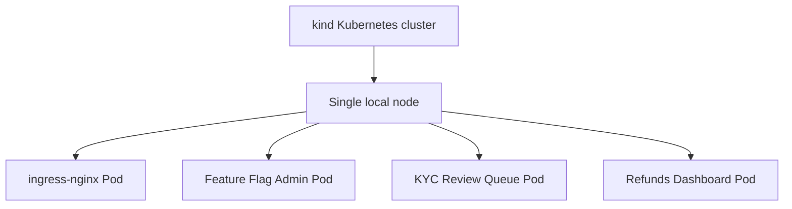
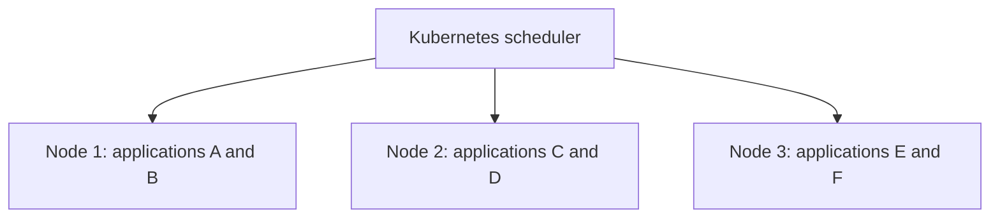
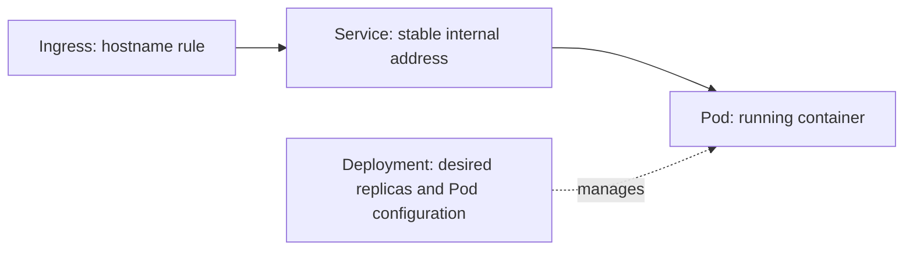
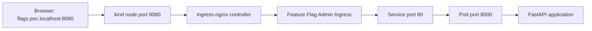
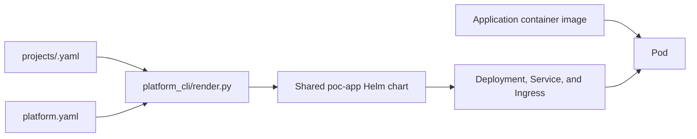

# How Kubernetes runs multiple applications

This platform runs each application in its own container and Kubernetes Pod.
Kubernetes schedules those Pods onto cluster machines called nodes, keeps the
requested number running, and routes each hostname to the correct application.

## 1. Cluster and node

Locally, kind creates a Kubernetes cluster with one node. The node is itself a
Docker container that behaves like a Kubernetes machine.



All applications share the node's CPU and memory, but they run in separate
containers with separate processes and filesystems.

In a larger cluster, the Kubernetes scheduler can distribute Pods across many
nodes. Application definitions remain the same; only their scheduled locations
change.



## 2. Resources created for each application

The shared Helm chart creates a Deployment, Service, and Ingress for every
project. The Deployment then creates and manages the application's Pods.



For example, `feature-flag-admin` is installed as one Helm release in the
`poc-feature-flag-admin` namespace.

### Deployment

A Deployment declares the desired application state. For Feature Flag Admin it
means, in simplified form:

```text
Run 1 replica of poc/feature-flag-admin:0.1.0
Expose container port 8000
Check GET /healthz every 5 seconds
```

Kubernetes continuously reconciles actual state with this declaration. If the
Pod crashes or is deleted, the Deployment creates a replacement.

Changing `replicas` in the project configuration changes how many Pods the
Deployment maintains.

### Pod

A Pod is Kubernetes' smallest deployable runtime unit. In this platform, each
application Pod contains one application container:

```text
Feature Flag Admin Pod
└── Python container
    └── Uvicorn and FastAPI listening on port 8000
```

Different applications may all listen on port 8000 because every Pod has its
own network namespace and IP address. This is similar to several separate
machines using the same port.

### Service

Pod IP addresses are temporary because Pods can be replaced. A Service gives an
application a stable internal address and selects its ready Pods by label:

```text
feature-flag-admin Service port 80
              |
              +--> ready Feature Flag Admin Pod port 8000
```

When a Deployment has multiple replicas, the Service distributes requests
among the ready Pods.

### Ingress

An Ingress defines how HTTP traffic outside the cluster reaches a Service. All
applications share the ingress-nginx controller, but each has a different
hostname rule:

```text
flags.poc.localhost   -> feature-flag-admin Service
kyc.poc.localhost     -> kyc-review-queue Service
refunds.poc.localhost -> refunds-dashboard Service
```

The controller examines the HTTP `Host` header and forwards the request to the
matching Service.

## 3. Complete request path

A request to Feature Flag Admin follows this path:



The same ingress controller receives requests for all applications. Hostname
rules separate the traffic before it reaches an application namespace.

## 4. Namespaces

The platform creates one namespace per project:

```text
poc-feature-flag-admin
├── Deployment
├── Service
├── Ingress
└── Pod

poc-kyc-review-queue
├── Deployment
├── Service
├── Ingress
└── Pod
```

Namespaces provide resource organization, separate names, and lifecycle
boundaries. Deleting a project's namespace removes its namespaced resources.

A namespace alone is not a complete security boundary. Strong isolation also
requires controls such as NetworkPolicy, resource quotas, Pod Security, and
restricted service accounts, which this POC does not configure.

## 5. Scheduling and capacity

Every application Pod declares resource requests and limits through the shared
chart:

```yaml
resources:
  requests:
    cpu: 50m
    memory: 128Mi
  limits:
    cpu: 500m
    memory: 512Mi
```

The scheduler uses requests to choose a node with enough capacity. Limits
restrict how much CPU and memory a container may consume.

On the local one-node cluster, all application Pods run on the same node. In a
multi-node cluster, Kubernetes can spread them across available nodes while
Services continue routing traffic without callers needing to know each Pod's
location.

## 6. Desired state and self-healing

Kubernetes runs a reconciliation loop rather than executing a deployment once:

```text
Desired state: one ready Feature Flag Admin Pod
Actual state:  no Feature Flag Admin Pod
Action:        create a replacement Pod
```

The Deployment owns replica management, the readiness probe determines whether
a Pod may receive traffic, and the Service selects only matching ready Pods.
This combination allows applications to be replaced or scaled without changing
their public URL.

Kubernetes can restart failed containers and replace failed Pods. It does not
make the application's data durable automatically. In this POC, `/data` is not
backed by a persistent volume, so replacing a Pod also replaces its local data.

## 7. How this repository produces the resources

The path from project configuration to running application is:



The project file selects the image, hostname, port, environment variables, and
replica count. The chart gives every project the same Kubernetes shape.

The essential model is:

> Kubernetes runs applications in separate Pods, schedules those Pods onto
> shared nodes, keeps their declared replica count running, and uses Services
> and Ingress to route traffic to the correct application.
