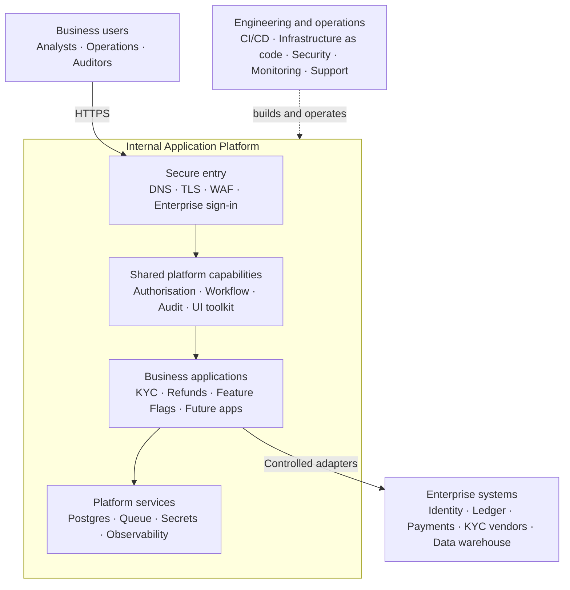
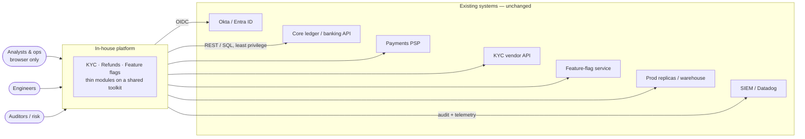
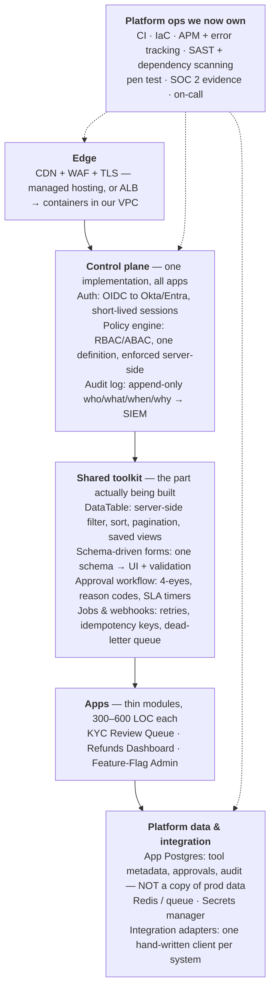
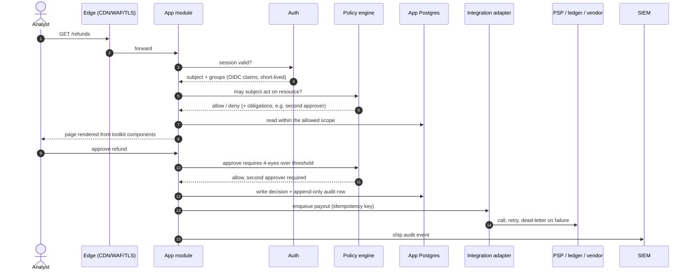
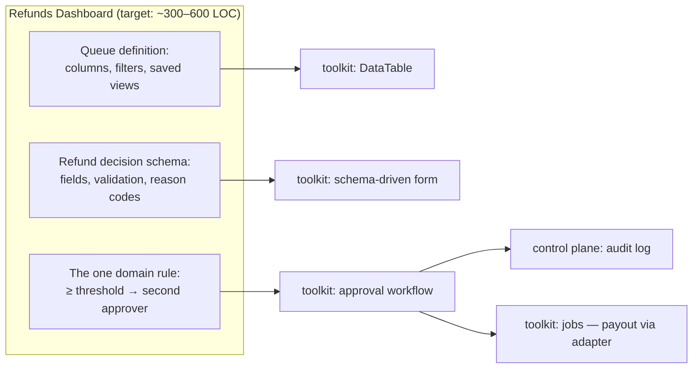
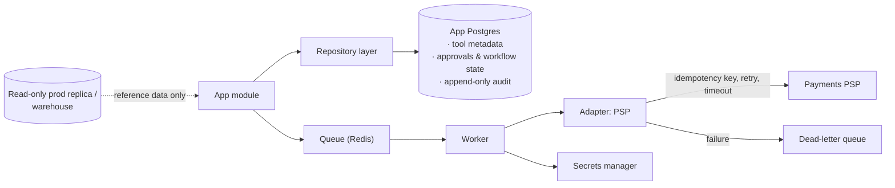
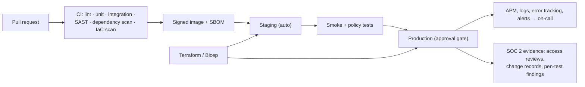

# Target architecture

*Where this is going.* For what runs today see
[architecture.md](architecture.md); for the difference between the two and what
it costs to close, see [gap-analysis.md](gap-analysis.md) and
[migration-plan.md](migration-plan.md). For the concise prototype assessment
used in the build-versus-buy document, see
[in-house-solution-prototype.md](in-house-solution-prototype.md).

The original sketch this document formalises:

**The thesis.** The three applications are thin. The expensive part is the
shared layer underneath them — identity, policy, audit, and a UI/workflow
toolkit. Build that once and each additional application is days rather than
weeks. Everything below follows from that one claim, and the whole point of the
next phase of work is to test it.

## End-state architecture at a glance

This is the simplified target view for presentations and general design
documents:

Read it from top to bottom:

1. Business users enter through one secured edge and enterprise sign-in.
2. Every application uses the same authorisation, workflow, audit, and user
   interface capabilities.
3. Applications contain mainly their own business rules and screens.
4. Shared data, queues, secrets, and observability support all applications.
5. Controlled adapters connect applications to existing systems of record.
6. A platform team delivers and operates the complete environment.

The boundary is important: the platform owns workflow and operational evidence,
but enterprise systems such as the ledger and payment provider remain the
systems of record.

## 1. Context

The platform owns workflow, policy and evidence. It owns **no** system of
record: the ledger stays the ledger, the PSP stays the PSP, and the identity
provider stays the identity provider.

## 2. Layers

Read the arrows as "sits above": a request enters at the edge, is authenticated
and authorised once, is served by an app module built out of toolkit
components, and reaches external systems only through an adapter.

## 3. A request, end to end

Three rules define the target and none of them hold today:

1. **Identity is never asserted by the caller.** It comes from the IdP.
2. **Authorisation is one definition** consulted by every app, not per-app `if`
   statements in three different vocabularies.
3. **Every state change writes an append-only audit row** in one schema, shipped
   off-platform for retention.

## 4. What "thin app" means

An app contributes its domain vocabulary and its rules. Table rendering,
pagination, validation, four-eyes, reason codes, SLA timers, retries and audit
formatting come from below it. That is the reuse the business case rests on:
today each of those is written three times.

## 5. Data and integration

Rules for this layer:

- The app database holds **workflow state and evidence only** — never a copy of
  a system of record.
- Every external call goes through an adapter with a timeout, a retry policy, an
  idempotency key and a dead-letter path. No app calls a vendor directly.
- Credentials come from a secrets manager at runtime; none exist in a manifest
  or a repository.

## 6. Delivery and operations

This is the part of the picture that used to belong to a SaaS vendor. Owning
the platform means owning CI, IaC, observability, scanning, penetration
testing, compliance evidence and a pager rota — the recurring cost, not a
one-off.

## 7. Environments

| | Local | Staging | Production |
| --- | --- | --- | --- |
| Identity | IdP dev tenant | IdP staging tenant | IdP production tenant |
| Data | seeded synthetic | synthetic + masked | real, minimised |
| External systems | adapter fakes | vendor sandboxes | live |
| Deployment | one command | automatic on merge | approval gate |
| Data retention | disposable | short | policy-defined, audit immutable |

## 8. Non-functional targets

| Property | Target |
| --- | --- |
| Availability | Business-hours SLO with an on-call rota; a single-AZ failure is survivable |
| Latency | Interactive queue operations under ~500 ms server-side at the 95th percentile |
| Authentication | 100% of requests carry an IdP-issued session; no header-asserted identity anywhere |
| Authorisation | Every decision from one policy definition, testable in isolation |
| Audit | Append-only, tamper-evident, shipped to SIEM, retention set by policy |
| Data protection | No system-of-record copies; PII minimised, encrypted at rest and in transit |
| Recovery | Documented RPO/RTO with restores actually rehearsed |
| Supply chain | Signed images, SBOM per release, scanned dependencies |

## 9. What the target explicitly gives up

The sketch is honest about what a SaaS low-code platform provided and an
in-house build does not:

| Lost | Consequence |
| --- | --- |
| Citizen-developer authoring | Every operational change becomes an engineering pull request |
| A connector library | Each integration is a client we write, test and maintain |
| Native mobile / offline clients | Browser-only unless separately funded |
| DLP and environment governance out of the box | Has to be designed and enforced by us |
| Vendor compliance posture | Pen tests, uptime, evidence and the pager move to our team |

## 10. Economics as sketched

From the original diagram, carried forward unverified — these are the sponsor's
figures to challenge, not this document's:

- MVP (three apps + toolkit): ~6–10 engineering-weeks with Devin.
- Year-1 loaded cost: ~$80–150K. Ongoing: ~0.5 FTE plus infrastructure.
- Break-even against a ~$250K alternative: late year 1 into year 2.
- Sensitive to exactly one variable: **does the application count grow?** With
  three applications the shared toolkit is hard to justify; the case improves
  with every application after that.

## 11. Decisions this target assumes but has not settled

These are the assumptions to resolve before any of the above is built — see
[migration-plan.md](migration-plan.md#phase-0-decisions-before-any-code), where
each one is a gate.

| # | Assumption in the target | Status |
| --- | --- | --- |
| D1 | One stack: a single Next.js/TypeScript monorepo | Contradicts today's three independent Python containers |
| D2 | Hosting on managed edge / AWS-style containers | Contradicts the AKS + Bicep the POC actually deploys to |
| D3 | The application count will grow beyond three | Unverified; the entire business case depends on it |
| D4 | Postgres as the single application database | Today each app owns a disposable SQLite |
| D5 | One policy vocabulary can express three domains | Untested against the three role models that exist |
| D6 | The team can carry on-call and SOC 2 evidence | An ongoing staffing commitment, not a project cost |
