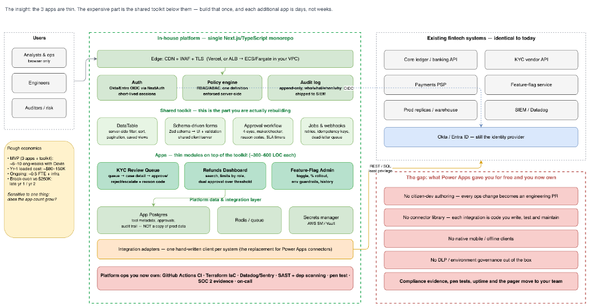

# Target architecture, and how this POC maps onto it

The in-house platform this prototype is a rehearsal for — for the current state
it is being compared against, see [poc-architecture.md](poc-architecture.md):

**Short answer: this POC is a faithful small-scale version of the hosting half —
edge, one identity, app catalog, governance, per-app data — and it does not yet
contain the shared toolkit half, which is where the target architecture says the
cost and the value are.**

That target's thesis is "the 3 apps are thin; the expensive part is the shared
toolkit below them — build that once, and each additional app is days, not
weeks". This POC is currently the opposite shape: the platform is thin (~2.3k
lines of gateway, supervisor, identity and policy) and the apps are fat and
written in three different stacks.

## Box by box

| Target | In this POC today | Verdict |
| --- | --- | --- |
| **Edge** — CDN + WAF + TLS | FastAPI gateway on `:8080`, one origin, apps mounted at `/apps/<id>/`, prefix-preserving reverse proxy | Same shape, no TLS/WAF/CDN — deliberate |
| **Auth** — Okta/Entra OIDC via NextAuth, short-lived sessions | Persona picker; the gateway injects `X-Platform-User`/`-Role` and strips spoofed copies. Apps never implement login | Same shape, mocked. Graduation item #1 |
| **Policy engine** — RBAC/ABAC, one definition, enforced server-side | Half. `platform.yaml` is one definition of *who holds which role where*, but the rules themselves live in three codebases with three vocabularies, and the gateway denies nothing | Biggest addressable gap |
| **Audit log** — append-only, who/when/what/why, shipped to SIEM | Each app has its own audit table with actor, action, reason and timestamp. No platform-level aggregation or export | Half |
| **Shared toolkit** — DataTable, schema-driven forms, approval workflow, jobs & webhooks | Absent. Nothing above the runtime layer is shared | Missing |
| **Apps** — thin modules, 300–600 LOC each | 844 / 2,379 / 3,176 LOC across three stacks. Queue table, filter bar, decision form and audit timeline are written three times | Contradicts the thesis |
| **Platform data** — App Postgres, Redis/queue, secrets manager | One disposable SQLite per app under `PLATFORM_DATA_DIR`; no queue, no secret store | Simplified — deliberate |
| **Integration adapters** — one hand-written client per system | Absent. The prototypes have no external systems at all; every payout, screening and flag read stops at seeded data | Missing |
| **Platform ops** — CI, IaC, observability, SAST, pen test, SOC 2, on-call | None; the repository has no CI workflow | Missing |
| **Governance** (the DLP / environment-governance row of the gap panel) | `poc.yaml` + `policy.yaml`: manifests are validated on load and a non-compliant app cannot be started | Ahead of expectations |

## What this POC does and does not evidence

It evidences: one URL and one identity across three unrelated stacks; per-app
RBAC driven by a single persona choice; governance enforced by code rather than
by a wiki page; and that each prototype still runs standalone.

It does **not** evidence the claim the business case rests on — that app #4 costs
days rather than weeks — because nothing above the runtime layer is shared yet.
The increments that would close that gap are in [roadmap.md](roadmap.md).

## Deliberate divergences (not gaps)

- **Three stacks, not one Next.js monorepo.** The point of this POC was hosting
  prototypes that already existed and disagreed about everything. The target's
  single-monorepo assumption is what makes its toolkit possible; converging on
  one stack is a precondition for that box, not a detail.
- **Process-per-app supervision** instead of a build-and-deploy pipeline.
- **Mocked identity by design**, so reviewers can switch persona mid-demo. See
  [poc-environment.md](poc-environment.md) for the full list of what this
  environment may and may not be used to conclude.
